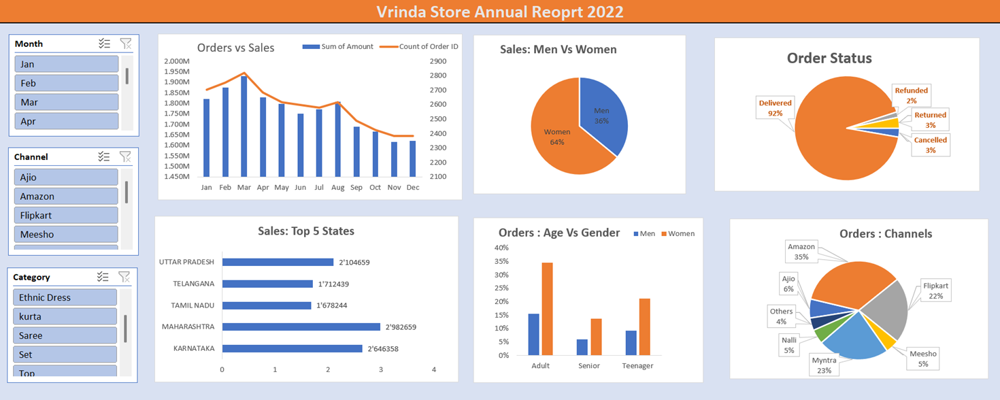

# Vrinda Store Sales Analysis 2022

##  Project Overview

This project analyzes Vrinda Store's 2022 sales and order data using Microsoft Excel.

The objective is to understand sales performance, customer demographics, order status, sales channels, and geographic performance to identify useful business insights.

---

##  Business Objectives

- Analyze monthly sales and order trends
- Compare purchasing behavior between men and women
- Identify the top-performing states
- Analyze orders by age group and gender
- Understand order status distribution
- Identify the highest-performing sales channels
- Create an interactive Excel dashboard

---

##  Tools & Technologies

- **Microsoft Excel**
- Pivot Tables
- Pivot Charts
- Slicers
- Data Cleaning
- Data Transformation
- Dashboard Development

---

##  Data Preparation

The raw dataset was cleaned and prepared before analysis.

Steps included:

- Removing unnecessary data
- Standardizing categorical values
- Cleaning gender and quantity values
- Creating an **Age Group** column
- Creating a **Month** column
- Formatting dates
- Checking data consistency
- Preparing the dataset for Pivot Table analysis

---

##  Dashboard

The interactive dashboard provides analysis of:

- Orders vs Sales
- Sales by Gender
- Order Status
- Top 5 States by Sales
- Orders by Age Group and Gender
- Orders by Sales Channel

### Dashboard Preview



---

##  Key Insights

- Women contributed approximately **65% of total sales/orders**.
- Maharashtra, Karnataka and Uttar Pradesh were among the top-performing states.
- The **Adult age group (30–49 years)** contributed the largest share.
- Amazon, Flipkart and Myntra were the major contributing sales channels.
- The majority of orders were successfully **delivered**.

---

##  Project Structure

```text
vrinda-store-sales-analysis/
│
├── Data/
│   └── Vrinda Store Raw Data.xlsx
│
├── Dashboard/
│   └── Vrinda Store Data Analysis 2022.xlsx
│
├── Documentation/
│   └── Vrinda Store Sales Analysis Documentation.docx
│
├── Screenshots/
│   ├── 01_Dashboard.png
│   ├── 02_Sales_vs_Orders.png
│   ├── 03_Men_vs_Women.png
│   ├── 04_Order_Status.png
│   ├── 05_Top_5_Sales.png
│   ├── 06_Age_and_Gender.png
│   └── 07_Orders_Channels.png
│
└── README.md

## 👤 Author
**Shreyas Chavan**
Aspiring Data Analyst | Excel | SQL | Python | Power BI
